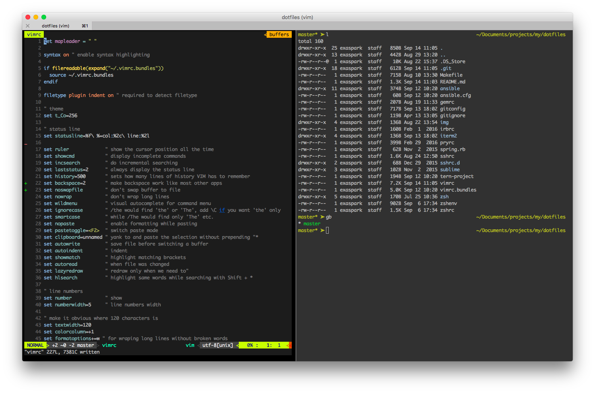

# dotfiles



## Requrements

* Git

## Install

```
git clone git@github.com:exAspArk/dotfiles.git

make install_ansible

make install_homebrew
make install_homebrew_apps
make install_oh_my_zsh
make install_homebrew_cask_apps

make configure_vim
make configure_dotfiles

make configure_backups
```

## Other tools and apps:

### Apps

* Docker for Mac
* Simplenote
* Keynote
* Pocket
* Twitter
* Xcode

### Google Chrome extensions

* AngularJS Batarang
* EditThisCookie
* Flashcontrol
* Ghostery
* Google Dictionary (by Google)
* HTTPS Everywhere
* JSON Formatter
* Postman
* Save to Pocket
* Speed Dial 2
* uBlock

### Android apps

* 2GIS
* Authenticator
* Barcode Scanner
* Booking.com
* Bookmate
* CamScanner
* Chrome
* Citymapper
* Couple
* Dropbox
* Epayments
* ES File Explorer
* Facebook
* Flickr
* Foursquare
* Gmail
* GoPro
* Hangouts
* Hellenic Bank
* Hipchat
* Keepass2Android
* Maps (Yandex)
* MAPS.ME
* Messenger (Facebook)
* Metro (Yandex)
* Money Lover
* Moscow Parking
* Navigator
* Pocket
* Raiffeisen
* Revolut
* Simplenote
* Skype
* Slack
* Taxi (Yandex)
* Tinkoff
* Translate
* Transport (Yandex)
* Trello
* Twilight
* Twitter
* Viber
* VLC
* Weather (Yandex)
* WhatsApp
* Xender
* xFi Locator
* Yandex.Navi
* Youtube
* Сбербанк
* @Voice
