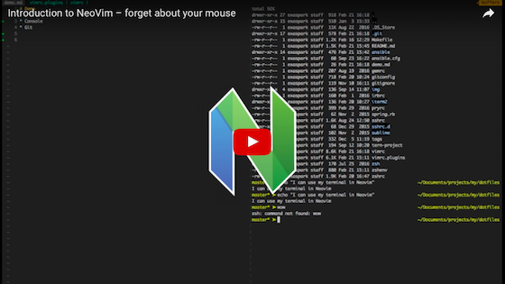

# dotfiles

## Demo

<a href="https://www.youtube.com/watch?v=XqWLLvihz4Q" align="center"></a>

## Requrements

* Git

## Install

```
# Install Dropbox

mkdir ~/.ssh
cp $BACKUP_PATH/ssh/* ~/.ssh
chmod 600 ~/.ssh/id_rsa

mkdir -p $PROJECT_PATH/my
cd $PROJECT_PATH/my
git clone git@github.com:exAspArk/dotfiles.git

xcode-select --install
sh -c "$(curl -fsSL https://raw.githubusercontent.com/ohmyzsh/ohmyzsh/master/tools/install.sh)"
/bin/bash -c "$(curl -fsSL https://raw.githubusercontent.com/Homebrew/install/master/install.sh)"

curl --proto '=https' --tlsv1.2 -sSf -L https://install.determinate.systems/nix | sh -s -- install # https://github.com/DeterminateSystems/nix-installer
nix-build https://github.com/LnL7/nix-darwin/archive/master.tar.gz -A installer && NIXPKGS_ALLOW_UNFREE=1 ./result/bin/darwin-installer && rm -rf ./result
# If you see this error: Problem with the SSL CA cert (path? access rights?) (77)
# sudo rm /etc/ssl/certs/ca-certificates.crt
# sudo ln -s /nix/var/nix/profiles/default/etc/ssl/certs/ca-bundle.crt /etc/ssl/certs/ca-certificates.crt

export PATH=$PATH:/opt/homebrew/bin
make install_cli_apps
make install_gui_apps
make configure_dotfiles
make configure_backups

cd ~/.config/coc/extensions && pnpm install
git clone https://github.com/elixir-lsp/elixir-ls.git ~/.config/coc/elixir-ls
cd ~/.config/coc/elixir-ls && mix deps.get && mix compile && mix elixir_ls.release -o release
```

Set up [GPG](https://gist.github.com/exAspArk/d5cffe82f3151c40669be1aa4122e952#method-2) by using Method 2.

## Other tools and apps:

* pCloud
* OBS
* Grammarly Desktop
